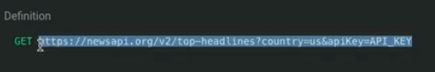
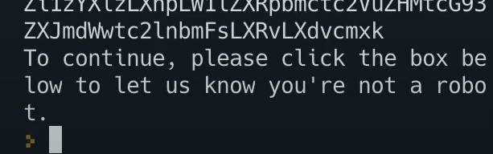

# API Smash Battle

That's right folks. Everyone loves a good mashup. So, today we're going to learn how to combine data from more than one API.

## NewsAPI

👉  Let's get signed up for our APIs. First up is [News API](https://newsapi.org/).


- Hit 'Get API Key'
- Create an account
- Copy the API key
- Add it as a secret to your repl called **newsapi**
- Go to the _[get started guide](https://newsapi.org/docs/get-started)_
- Choose the **Get current top articles** option and grab the full URL for the GET request

- Put it in your code as an fString. Replace the last bit with a `{newsKey}` variable (that will store the API key).  We'll break it down further in a bit.

```python
url = f"https://newsapi.org/v2/top-headlines?country=us&apiKey={newsKey}"
```
## Import os
- Now import the `os` library and add the API key in using the code in the secrets menu.

```python
import os

newsKey = os.environ['newsapi']

url = f"https://newsapi.org/v2/top-headlines?country=us&apiKey={newsKey}"
```
## Request time
👉 Now it's request time. I'm going to replace the hard coded 'country code' in the `url` with a variable to make it customizable later on.

```python
import os

newsKey = os.environ['newsapi']
country = "us"

url = f"https://newsapi.org/v2/top-headlines?country={country}&apiKey={newsKey}"

```

👉 Next, create the request, send it the url, format the data returned as json and print it out so we can see what we get back.
```python
import requests, json, os

newsKey = os.environ['newsapi']
country = "us"

url = f"https://newsapi.org/v2/top-headlines?country={country}&apiKey={newsKey}"

##### The new bit ###################
result = requests.get(url)
data = result.json()
print(json.dumps(data, indent=2))
```

👉 Inspecting the data returned tells us what information we can extract.  I'm going to print out just the titles, URL links, and content by using a loop. 

For this, I've commented out the `print(json.dumps(data, indent=2))` line so that it doesn't output everything. This is useful for testing, so I've just made it a comment instead of deleting it completely.

```python
import requests, json, os

newsKey = os.environ['newsapi']
country = "us"

url = f"https://newsapi.org/v2/top-headlines?country={country}&apiKey={newsKey}"

result = requests.get(url)
data = result.json()
# print(json.dumps(data, indent=2))


##### The new bit #####################
for article in data['articles']:
  print(article['title'])
  print(article['url'])
  print(article['content'])

```

Sometimes, however, the content isn't great. See below:



To help tidy this up, we can plug it into another service.

## Try it out!