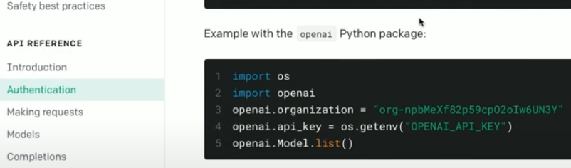
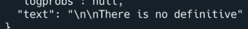

# OpenAI

The second half of our mashup uses [openAI](https://openai.com/api/)

Again, you'll need to create an account, verify your email, and validate with your mobile number.

You do only get a certain amount of use out of the free trial. So if you use this a lot then it will run out.

## 

OpenAI allows us to tell a computer to do something _in plain text._

👉  There are quite a few steps involved in setup, so read these next instructions carefully.

- Go to your profile and click **view API Keys**
- Create a new secret key
- Copy the API key
- Add it as a secret to your repl called **openai**
- Now get your **organization ID** (from the 'settings' menu on the left of the 'View API Keys' screen).
- Make a new secret called **organizationID** for this.
- Next, **move all of your previous code into a new file called 'news.py'**
- Bring your 'openai' secrets into **main.py**
```python
import requests, json, os

openai = os.environ['openai']
orgid = os.environ['organizationID']
```
- Go to the **documentation** menu on the website and scroll down until you find **authentication**
- Copy the **Example with the openai Python package** code:

- Paste the code from openai into **main.py** and combine it with the secrets to remove the extra `os` import and to take advantage of Replit not needing to install libraries.

```python
import requests, json, os
import openai

openai.organization = os.environ['organizationID']
openai.api_key = os.environ['openai']
openai.Model.list()
```
## Completion
👉  The openai [API Reference](https://beta.openai.com/docs/introduction/overview) page shows me lots of things that I can do. I'm going to start with a **completion**. This example should talk to openai and say 'this is a test'. I've printed the response to show that happening.

```python
response = openai.Completion.create(model="text-davinci-002", prompt="Say this is a test", temperature=0, max_tokens=6)

print(response)
```
When you run this, you'll see that it comes back in a top level of 'choices' and second level 'text'. 

👉 Let's manipulate it to see if we can get it to do something else.

I've replaced the hard coded `prompt` with a variable.

```python
prompt = "Who is the most handsome bald man?"

response = openai.Completion.create(model="text-davinci-002", prompt=prompt, temperature=0, max_tokens=6)

print(response)
```
Unfortunately, openai has no definitive answer for this question!


👉 To just output the text (and strip out the odd white space) I've changed the print to this:

```python
print(response["choices"][0]["text"].strip())
```

## Whole code

```python
import requests, json, os
import openai

openai.organization = os.environ['organizationID']
openai.api_key = os.environ['openai']
openai.Model.list()

prompt = "Who is the most handsome bald man?"

response = openai.Completion.create(model="text-davinci-002", prompt=prompt, temperature=0, max_tokens=6)

print(response["choices"][0]["text"].strip())
```

## Try it out!