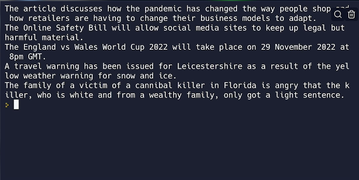

# 👉 Day 94 Challenge

Today's challenge is to combine the two APIs to make something cool.

Your program should:

1. Get all the news stories for the day from NewsAPI.
2. Send off a request to openai to summarize the stories.
3. Make a simple command line program that gives you 5 top news stories for the day whenever you click `run`.
    
Example:

 
 💡 Hints 

  
- Send off a prompt to openai that says 'summarize' and includes the URL of the story to be summarized.

